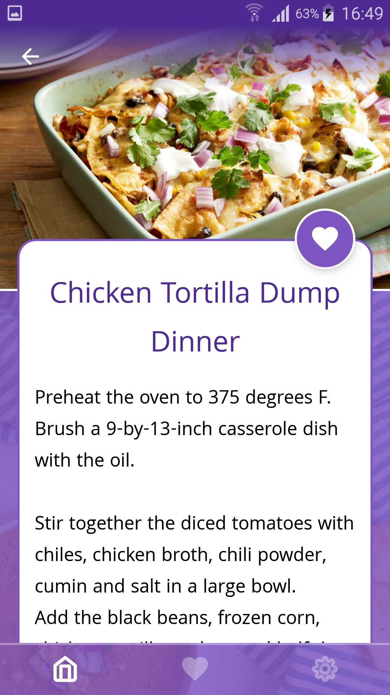
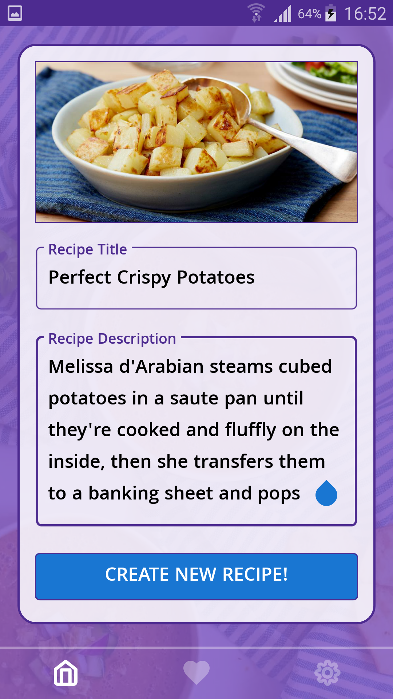
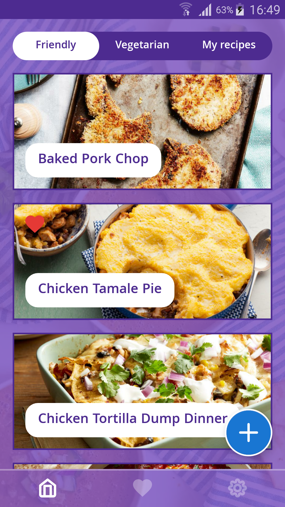
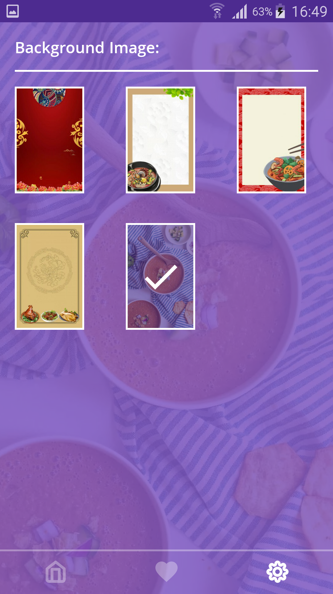
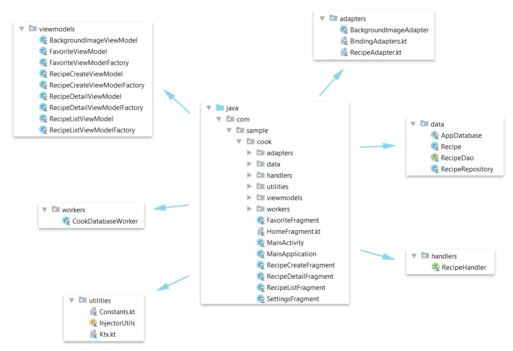

Cook Android App
=========================

A kotlin sample app illustrating some Android development best practices with Android Jetpack.

<p align="center">




</p>

## Features

The app displays a list of recipes - family friendly, vegetarian and personal. Users can see details about recipes, and they can put likes to recipes that interest them. 

Other features include creating new personal recipes, changing application background image.

## Development Environment

The app is written entirely in Kotlin and uses the Gradle build system.

## Architecture

The app is built on top of the last year's app. The architecture is built around
[Android Architecture Components](https://developer.android.com/topic/libraries/architecture/).

We followed the recommendations laid out in the
[Guide to App Architecture](https://developer.android.com/jetpack/docs/guide)
when deciding on the architecture for the app. We kept logic away from
Activities and Fragments and moved it to
[ViewModel](https://developer.android.com/topic/libraries/architecture/viewmodel)s.
We observed data using
[LiveData](https://developer.android.com/topic/libraries/architecture/livedata)
and used the [Data Binding Library](https://developer.android.com/topic/libraries/data-binding/)
to bind UI components in layouts to the app's data sources.

We used a Repository layer for handling data operations. Settings are stored in
SharedPreferences.

We used [Navigation component](https://developer.android.com/guide/navigation)
to simplify into a single Activity app.

We used [Room](https://developer.android.com/jetpack/androidx/releases/room) for recipes.

We used [Glide](https://bumptech.github.io/glide) for image loading.

We used [Gson](https://github.com/google/gson) to convert a JSON string to an equivalent Java object..

## Project Structure

<p align="center">

</p>


## License

```
Copyright 2017 Iulian
Licensed under the Apache License, Version 2.0 (the "License");
you may not use this file except in compliance with the License.
You may obtain a copy of the License at

   http://www.apache.org/licenses/LICENSE-2.0

Unless required by applicable law or agreed to in writing, software
distributed under the License is distributed on an "AS IS" BASIS,
WITHOUT WARRANTIES OR CONDITIONS OF ANY KIND, either express or implied.
See the License for the specific language governing permissions and
limitations under the License.
```

