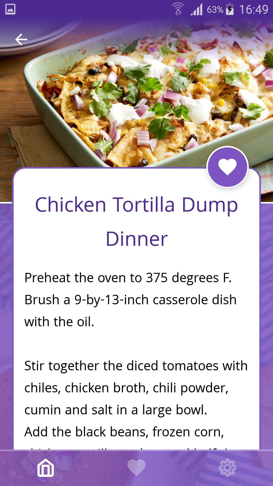
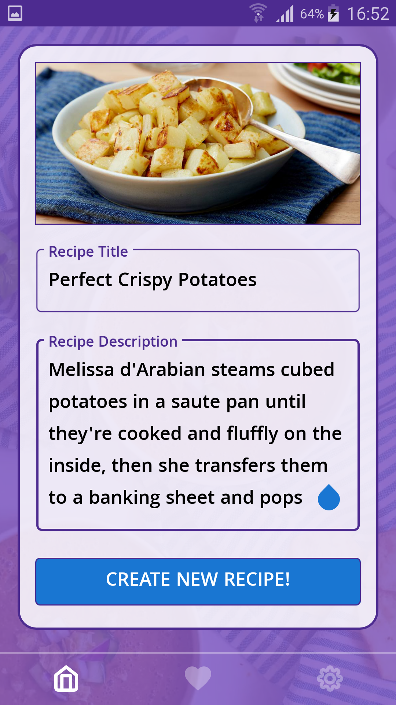
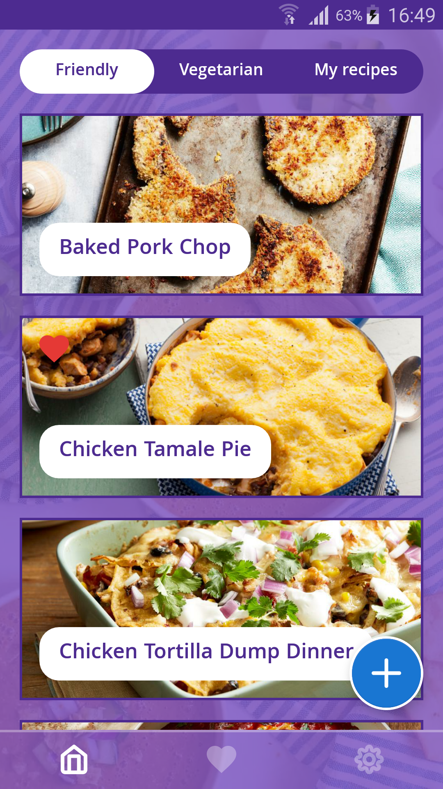
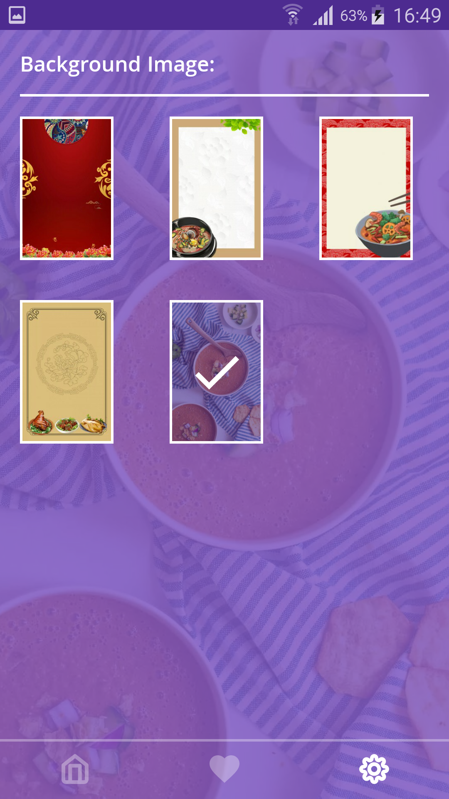

Cook Android App
=========================

A kotlin sample app illustrating some Android development best practices with Android Jetpack.

# Features

The app displays a list od recipes - family friendly, vegetarian and personal. Users can see details about recipes, and they can star events that interest them. 

Other features include creating new personal recipes, changing application background image.

# Development Environment

The app is written entirely in Kotlin and uses the Gradle build system.

# Architecture

The app is built on top of the last year's app. The architecture is built around
[Android Architecture Components](https://developer.android.com/topic/libraries/architecture/).

We followed the recommendations laid out in the
[Guide to App Architecture](https://developer.android.com/jetpack/docs/guide)
when deciding on the architecture for the app. We kept logic away from
Activities and Fragments and moved it to
[ViewModel](https://developer.android.com/topic/libraries/architecture/viewmodel)s.
We observed data using
[LiveData](https://developer.android.com/topic/libraries/architecture/livedata)
and used the [Data Binding Library](https://developer.android.com/topic/libraries/data-binding/)
to bind UI components in layouts to the app's data sources.

We used a Repository layer for handling data operations. Settings are stored in
SharedPreferences.

We used [Navigation component](https://developer.android.com/guide/navigation)
to simplify into a single Activity app.

We used [Room](https://developer.android.com/jetpack/androidx/releases/room) for recipes.

We used [Glide](https://bumptech.github.io/glide) for image loading.

